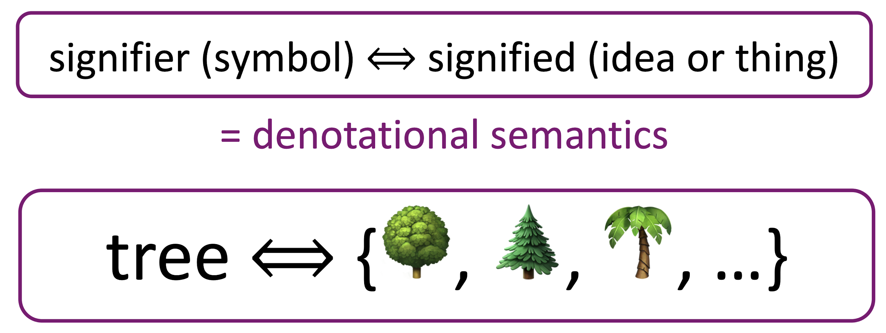
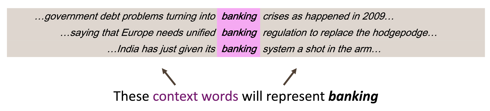
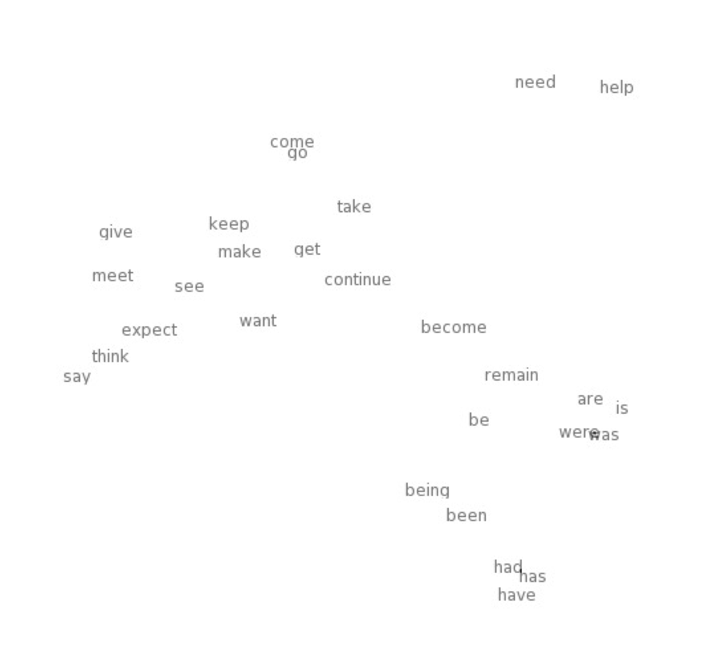
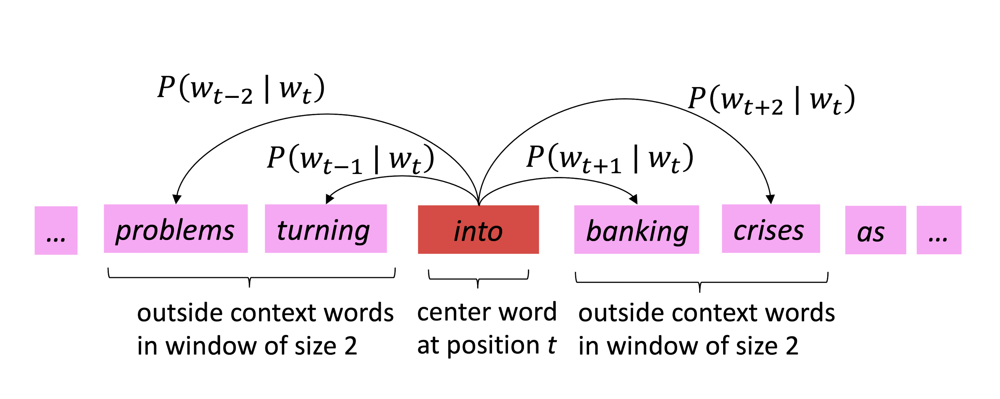
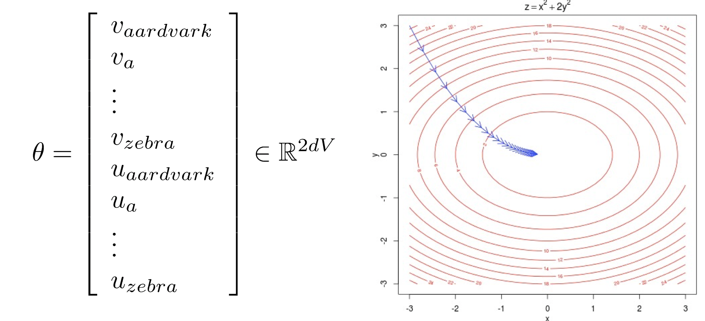
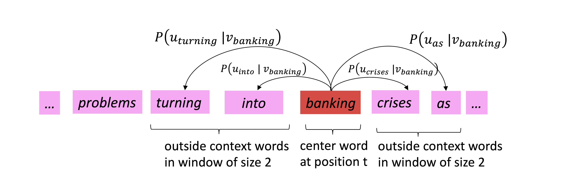

# Lecture 1 - Introduction and Word Vectors

|         작성자          |   작성일   |
| :---------------------: | :--------: |
| [최지원](jasonchoi.dev) | 2021.01.05 |

# 단어의 의미를 대표하는 방법 

## 의미란?

-   the idea that is represented by a word, phrase, etc.
-   the idea that a person wants to express by using words, signs, etc.
-   the idea that is expressed in a work of writing, art, etc.

기호가 idea나 thing을 나타낸다. (표사적 의미론)

# 컴퓨터가 의미를 표현하는 방법 - WordNet

과거 NLP에서 주로 사용하던 방법으로, 단어와 시소러스(유의어, 반의어)등을 포함한 Set 

참고 - [WordNet 위키피디아](https://ko.wikipedia.org/wiki/%EC%9B%8C%EB%93%9C%EB%84%B7)

##  WordNet의 문제점

-   뉘앙스를 반영하지 못함
-   신조어를 반영하지 못함
-   주관적인 관계
-   사람이 직접 만들어야 함
-   단어의 유사성을 계산할 수 없음

# 컴퓨터가 의미를 표현하는 방법 - Discrete Symbols

고전 NLP에서는 단어를 One-Hot Vector 같은 이산적인 상징으로 취급하였다. 

## One-Hot Vector

1개 1이 존재하고 나머지는 전부 0인 벡터, 벡터의 차원의 수와 사전에 포함된 단어의 수가 같음

하지만 One Hot Vector는 모든 Vector가 Orthogonal (직교) 하기 때문에 두 단어 사이의 유사성을 판단할 수 없다. 

따라서 단어의 유사성을 인코딩 할 수 있게끔 학습해야 할 필요가 있다. 

# 문맥에 따른 Word Representing

## Distributional Semantics

-   단어의 의미는 해당 단어의 인근에서 자주 등장하는 단어들에 의해 정해진다는 주장
-   통계 기반의 Modern NLP의 근간

# 단어 벡터 Word Vectors

단어마다 Dense Vector (Sparse Vector의 반댓말)를 만들어야 한다. 

비슷한 벡터를 가진 단어들은 비슷한 문맥에서 등장하게 한다. 

유사성을 내적 (Dot Product)를 통해 계산할 수 있다. 

Word Vector는 Word Embeddings나 Word Representations로 쓰기도 한다. 

시각화를 통해 비슷한 단어가 Clusturing돼서 나타나는 것을 볼 수 있다. 

# Word2Vec

단어 벡터를 학습하는 프레임워크의 이름 (Mikolov et al. 2013)

## 아이디어

-   거대한 단어 뭉치가 존재
-   사전 내의 모든 단어들은 벡터로 표현됨
-   특정 위치 $t$ 에 대해 중심 단어 (Center Word)$c$와 문맥 단어 (Context Word) $o$가 존재
-   Word Vector의 Similarity를 이용해서 $P(c|o)$ 또는 $P(o|c)$를 최대화한다. 

## Word2Vec의 Objective Function (목적 함수)

$$
{\rm Likelhood} = L(\theta) = \prod _{t=1}^T \prod_{-m \leq j \leq m, j \neq 0} P(w_{t+j} \mid w_t; \theta)
$$

특정 위치 $t$가 주어졌을 때 주변의 단어들이 존재할 확률을 최대화 해야함 

하지만 Product는 다루기 어렵고, 최댓값 보다는 최솟값을 찾기 위해서 $-\log$를 씌워서 아래와 같은 Objective Function(Loss Function 혹은 Cost Function 이라고도 함)을 만들어서 사용함. 
$$
J(\theta) = -\cfrac{1}{T} \log L(\theta) = - \cfrac{1}{T} \sum_{t=1}^T \sum_{-m \leq j \leq m, j \neq 0} \log P(w_{t+j} \mid w_t ; \theta)
$$
$\log P(w_{t+j} \mid w_t; \theta)$ 를 계산하기 위해 Prediction Function을 사용함

## Word2Vec의 Prediction Function (Softmax Function)

$$
P(o\mid c) = \cfrac{\exp{u_o^Tv_c}}{\sum_{w\in V}\exp(u_w^Tv_c)}
$$

위의 Prediction Function을 사용함. 

1.   벡터간의 내적은 두 벡터 $o$, $c$의 내적을 의미함. 내적이 클수록 확률이 높아진다. 
2.   $\exp$ 함수는 확률을 정의하기 위해 사용한다. 내적의 결과는 음수일 수도 있지만 확률은 양수야아 하니까 지수 함수에 씌워서 사용
3.   전체 Vocab에 대해서 Normalize 해서 확률 분포를 얻어낸다 (분모)

위 식을 Softmax Function이라고도 하는데, Softmax Function이란 $\mathbb{R}^n \rightarrow (0,1)^n$ 의 대응 관계를 갖는 함수이며,
$$
{\rm softmax}(x_i) = \cfrac{\exp(x_i)}{\sum_{j=1}^n \exp(x_j)} = p_i
$$
가 성립한다. 

Softmax의 Soft는 Scale을 의미(작게 만들고)하고, Max는 최댓값을 의미한다. 

# 모델 학습 : 최적화와 Loss 최소화 

Loss 를 최소화 하기 위해 파라미터를 조정한다. Gradient를 따라서 최솟값을 향해 움직인다 (오른쪽 그림 참조)

$d$ 차원의 벡터와 $V$개의 단어가 있으므로 $\theta$는 $2dV$ 차원의 벡터가 된다. 
$$
J(\theta) = -\cfrac{1}{T} \log L(\theta) = - \cfrac{1}{T} \sum_{t=1}^T \sum_{-m \leq j \leq m, j \neq 0} \log P(w_{t+j} \mid w_t ; \theta)
\\
P(o\mid c) = \cfrac{\exp{u_o^Tv_c}}{\sum_{w\in V}\exp(u_w^Tv_c)}
$$
Gradient를 계산하기 위해   $v_c$에 대해 편미분 해보면 아래와 같다. 
$$
\cfrac{\partial}{\partial v_c}\log \cfrac{\exp{u_o^Tv_c}}{\sum_{w\in V}\exp(u_w^Tv_c)}
\\
\\
= \cfrac{\partial}{\partial v_c} u_o^T - \cfrac{\partial}{\partial v_c} \log \sum_{w=1}^V \exp(u_o^Tv_c)
\\\\
= u_o - \sum_{x=1}^V \cfrac{\exp(u_o^Tv_c)}{\sum_{x=1}^V \exp(u_x^Tv_c)} u_x
= u_o - \sum _{x=1}^V P(x\mid C)u_x
$$
첫째 줄에서 두번째 줄로 넘어갈 때의 로그 연산의 특징, 둘째 줄에서 셋째 줄로 넘어갈때 Chain Rule이 사용되었음에 유의하자.

마지막 줄의 의미는 Observed Vector와 Expectation Vector의 차로 해석할 수 있다. 

## Word2Vec : More Details

벡터 2개를 비교하는 이유 : Optimize 하기 쉬워서 

## Two Model Variants

-   Skip Grams (SG)
    -   Centor Word가 주어졌을 때 Context Words를 예측 하는 방식
-   Continuous Bag of Words (CBoW)
    -   Context Words가 주어졌을 때 Center Worrd를 예측 하는 방식

## 추가적으로 학습의 효율성을 위해 

-   Negative Sampling 
