| 작성자                  | 작성일        |
|:--------------------:|:----------:|
| [최지원](jasonchoi.dev) | 2021.01.05 |

# **Gradient Descent**

- 좋은 Word Vector를 얻기 위해서는 Cost Function $$J(\theta)$$ 를 가능한 한 작게 만들어야 한다. 
- Gradient Descent란 $$\theta$$ 를 변화함에 따라 $$J(\theta)$$를 작게 만드는 방법이다. 

## 아이디어

현재 $$\theta$$ 에서 $$J(\theta)$$의 Gradient(기울기)를 구하고, 음의 Gradient 방향으로 조금씩 움직인다고 생각해보자.

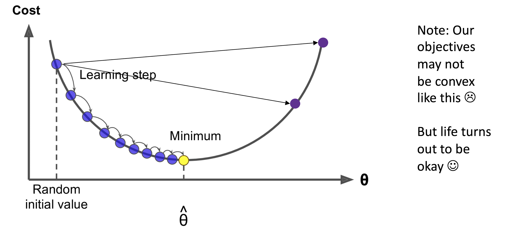

## 수식

$$
\theta^{new} = \theta^{old} - \alpha \nabla_\theta J(\theta)
$$

$\alpha$는 Learning Rate혹은 Step Size라고 하며 얼마나 많이 이동할지를 결정한다. 

위의 식을 단일 변수에 대해 나타내면 아래와 같다.
$
\theta^{new}_j = \theta^{old}_j - \alpha \cfrac{\partial}{\partial \theta^{old}_k} J(\theta)$
Pythonic Psudo Code로 나타내면 아래와 같다. 

```python
while True:
    theta_grad = evaluate_gradient(J, corpus, theta)
    theta = theta - alpha * theta grad
```

# **Stochastic Gradient Descent**

## Gradient Descent의 문제

$J(\theta)$ 는 모든 Corpus에 대한 함수이므로 $\nabla_\theta J(\theta)$ 를 구하는 것은 계산하는데 엄청난 비용이 필요하다. 

## Stochastic Gradient Descent

Window를 Sample 하고 (Batch) 그것들을 이용해서 $\theta$를 업데이트 하는 것을 반복한다. 

```python
while True:
  window = sample_window(corpus)
  theta_grad = evalutate_gradient(J, window, theta)
  theta = theta - alpha * theta_grad
```

## Stochastic Gradient Descent의 문제

$$
\nabla_\theta J_t(\theta) =
\begin{bmatrix}
0\\0\\0\\...\\\nabla_{v_{like}} \\ ... \\ 0 \\ 0 \\ \nabla_{u_I} \\ ...
\end{bmatrix} \in \mathbb{R}^{2dV}
$$

Window의 크기가 작기 때문에 Sample 된 Vector는 굉장히 Sparse (0이 대부분)하고, 실제로 나타나는 단어들에 대해서만 Update를 진행하게 된다. 

<details>
  <summary>Q : Sparse 하다면 어떤 문제가 발생할까?</summary>
  0때문에 메모리 상에 쓸데 없는 공간을 차지하게 됨. 컴퓨터는 $$2dV$$짜리 Matrix를 주고 받게 되니까...
</details>

### Solution

- Word Vector를 Row Vector로 사용한다. 

- Full embedding matricies $$U$$, $$V$$에서 각 단어에 해당하는 Row만 업데이트 한다. 
  
  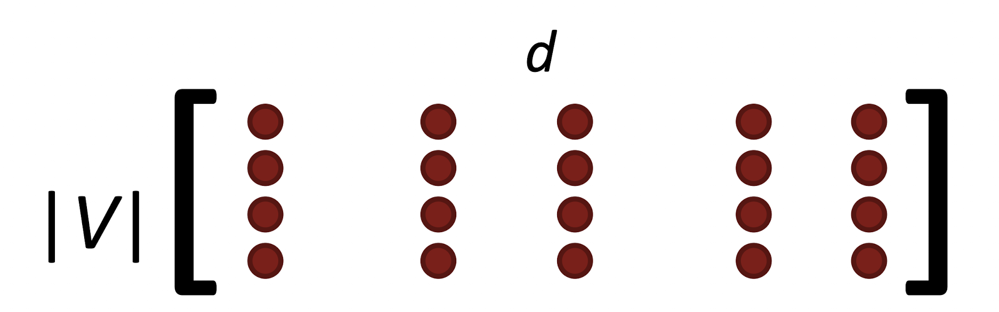

# **Word2Vec Algorithm Family**

- **2개의 벡터를 사용하는 이유?**
  - Optimize 하기 쉬움

## Two Model Variants

- Skip-Grams
- CBoW

# **Negative Sampling**

## Naive Softmax의 문제점

$ P(o \mid c) = \cfrac{\exp(u_o^T v_c)}{\sum_{w\in W} \exp(u_w^T v_c)}$ 를 계산하는 것이 매우 어려움 (분모를 계산하기 위해 모든 $$W$$에 대해 내적을 계산해야함)

## Main Idea

True Pair(중심 단어와 **옳은** 주변 단어) vs Noise Pair (중심 단어와 **틀린** 단어)를 Sampling 해서 Binary Logistic Regression을 수행

## Cost Function

$$
J(\theta) = \cfrac{1}{T} \sum^T_{t=1} J_t(\theta)
$$

<details>
  <summary>Binary Logistic Regression 이란?</summary>
  선형 회귀 분석을 이용하여 분류 문제를 풀고자 하는 것으로, Logistic Function에 내적 값을 넣어서 선형 회귀 분석을 하면 해당 데이터가 Class에 속할 확률을 출력할 수 있게 된다. 
</details>

를 최적화 하고자 하는 것은 동일하다. 하지만 여기서 약간의 테크닉을 사용한다.
$
J_t(\theta) = \log \sigma(u_o^Tv_c) + \sum_{i=1}^k \mathbb{E}_{j \sim P(w)}[\log\sigma(-u_j^Tv_c)]
$

- 내적 값을 Sigmoid Function에 넣어서 0과 1 사이로 mapping
- 랜덤하게 K개의 Noise Pair를 뽑아서 사용하자. (Unigram Distribution을 이용하여 자주 등장하는 단어를 Sample 한다.)
- True Pair가 등장할 확률은 최대화하고, Noise Pair(Negative Pair)가 등장할 확률은 최소화하도록 Optimize 한다. 

$$
J_{neg - sample} (u_o, v_c, U) = -\log \sigma(u_o^Tv_c) - \sum_{k\in\{K\ sampled \ indices\}} \log \sigma(-u_k^Tv_c)
$$

이렇게 써보면 조금 더 이해가 잘 될지도?

# **왜  Co-occurrence를 직접 세지 않을까?**

## Window Based Co-occurrence

Word2Vec과 비슷하게 단어 주변에 Window 만큼을 계산하여 Syntatic & Semantic Information을 얻어낸다.

### 예시

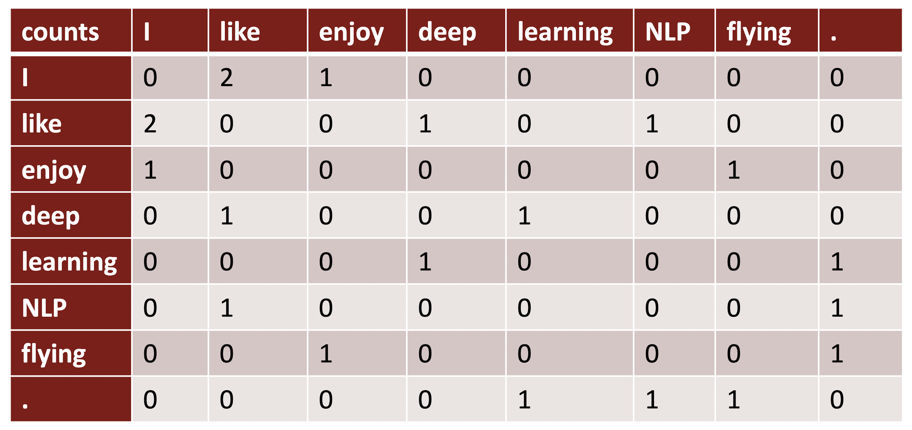

- I like deep learning.
- I like NLP
- I enjoy flying

### Co-occurence Vectors

Symetric 하고 Sparse 하고... 단어가 많은 만큼 Dimension이 커지기 때문에 크기를 너무 잡아먹는 문제가 있다. 

#### **그렇다면 Low-Dimensional Vector를 사용하면 어떨까?**

1. Singular Value Decomposition
   
   선형 대수학 참고 / 차원을 축소하는 고전적인 방법이다. 
   
   하지만 Raw Counts 에 대해 SVD를 적용하면 잘 되지 않는다.

2. Scaling the counts
   
   the, he, and, a 등의 단어가 지나치게 자주 등장하는 문제가 있음. 등장 빈도에 log 를 씌우거나, Max를 지정해 주는 등 scaling 하면 성능이 좋아짐
   
   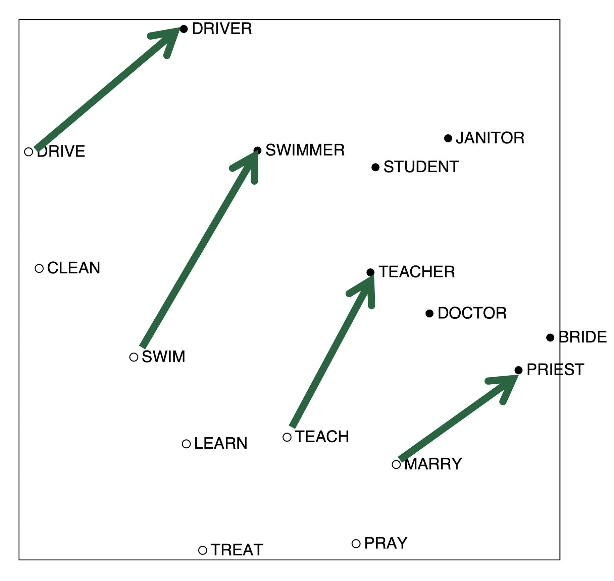

​    이런 Scaled Vector에서는 흥미로운 패턴이 나타남. 

# **Count Based vs Direct Prediction**

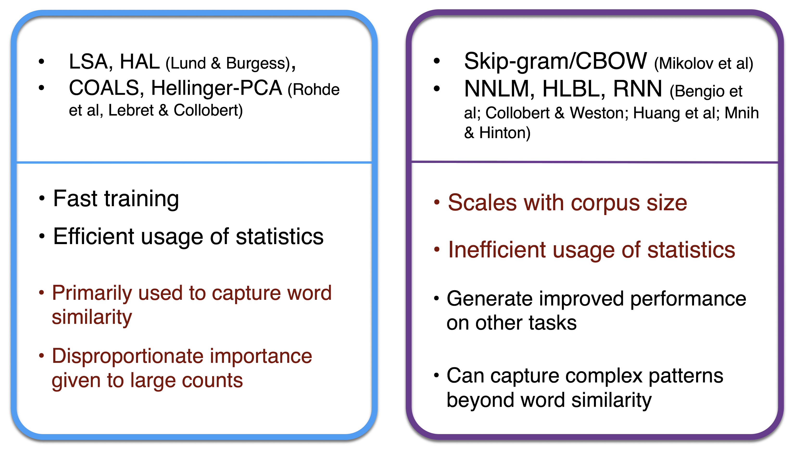

# **GloVe Model**

Count Based와 Direct Prediction을 섞어보자.

**Crucial Insight** : Ratio of co-occurrence probabilities가 components의 의미를 encode 할 수 있다.

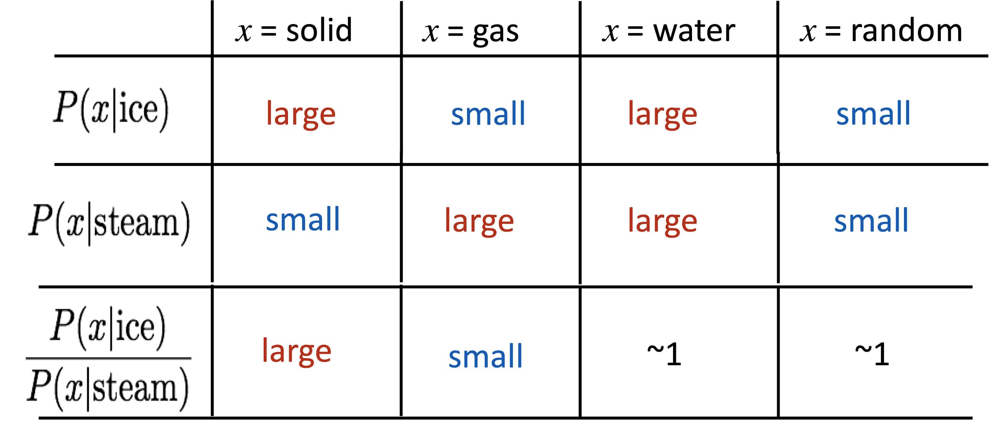 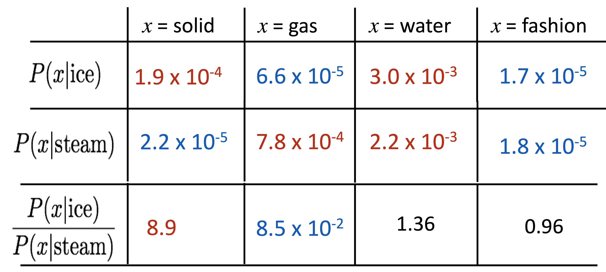

## 벡터의 차이에 의미를 인코딩하기

$$
w_i \cdot w_j = \log P(i\mid j) 
$$

$$
w_x \cdot (w_a - w_b) = \log \cfrac{P(x\mid a)}{P(x\mid b)}
$$

내적을 log probability로 정의하면 벡터 간의 더하기 빼기가 가능함

## Objective Function

$$
J = \sum _{i,j =1}^V f(X_{ij})(w_i^T\tilde w_j + b_i + \tilde b_j -\log X_{ij})^2
$$

$$
f(x) = \min (1, \cfrac {x}{x_{\max}}^{\cfrac{3}{4}})
$$

두 벡터의 내적이 $$\log({\rm co-occurrence})$$와 비슷해지도록 Optimize 한다. 

- Fast Training 
- Scalable to Huge corpora
- Corpus가 작고 Vector가 작아도 잘 작동함

# **Word Vector를 평가하는 방법**

## Intrinsic

- 특정 Subtask에 대해서 평가하는 방법
- 계산이 빠름
- System에 대해서 이해를 도움
- 실제 Task에 도움이 되는지 안되는지 모름

### Word Vector Analogy

man:woman :: king : ?

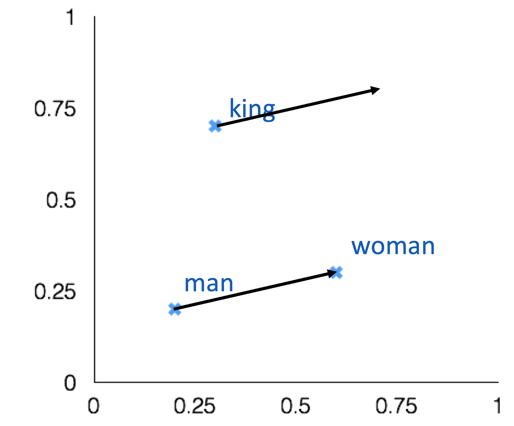

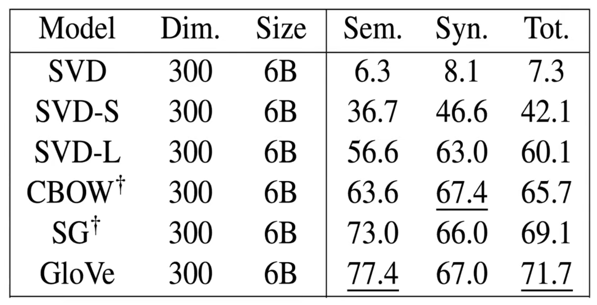

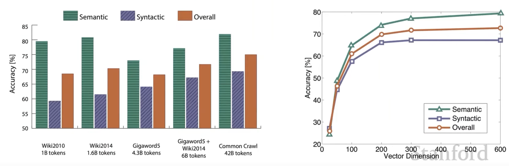

오른쪽 그래프를 통해 Vector Dimension을 300정도로 하는 이유를 알 수 있다. 

### Correlation with Human Judgement

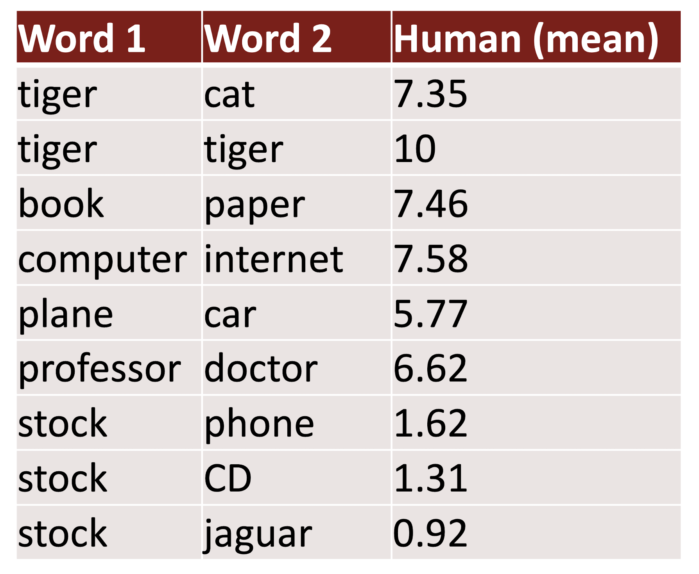

## Extrinsic

- 실제 Task에 대한 평가
- 계산이 오래걸릴 수 있음
- Subsystem에 문제가 있는지, 아니면 Interaction에 문제가 있는지, 혹은 다른 Subsystem에 문제가 있는지 불명확
- 하나의 Subsystem만을 바꿔서 Accuracy가 향상된다면 성공!

### Example : Named Entity Recognition

주어진 단어가 사람인지, 지역인지, 단체인지 등등을 분류하는 Task

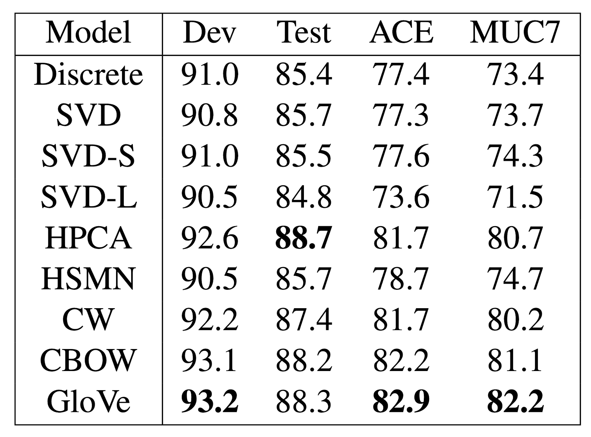

한번 적용해보고 성능이 높게 나오는 것이 좋은 것으로 해석

# **단어 인식의 모호성**

## 다의어

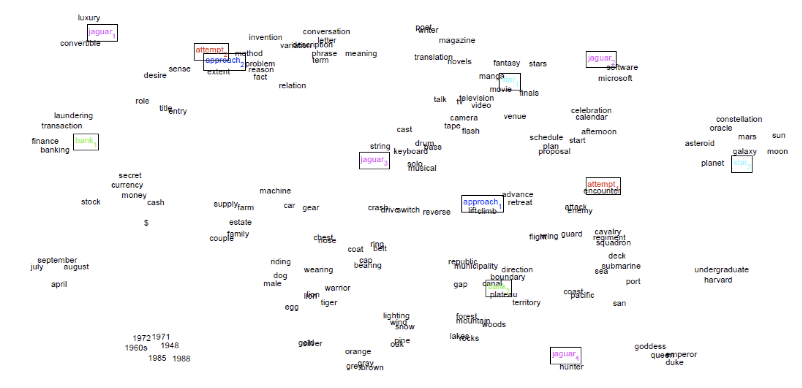

다의어를 반영해서 Representation 할 수 있음

## Linear Algebric Structure of Word Senses, With Application to Polysemy

- $v_{pike} = \alpha_1 v_{pike_1} + \alpha_2 v_{pike_w} + \alpha_3 v_{pike_3}$ 처럼 Weighted Sum으로 해석
- $\alpha_1 = \cfrac{f_1}{f_1 + f_2 + f_3}$  로 빈도수의 Ratio로 가중치를 결정
- 뭔가 이렇게 하면 다의어의 의미가 사라질 것 같지만 실제로는 그렇지 않음!
  - 아마 Word Vector가 Sparse 하기 때문에 다양한 단어의 의미를 하나의 Vector에 반영할 수 있을 것 같음

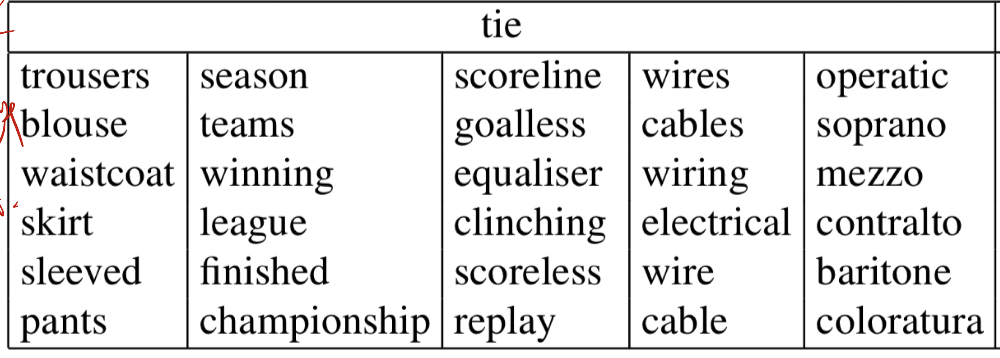

- tie에서 의미를 구분해내는 모습
