| 작성자 | 작성일        |
|:---:|:----------:|
| 김보민 | 2022.01.12 |

# **NER**

## task
텍스트에서 entity를 찾고 분석하는 것

> last night, Paris(*PER*) Hilton(*PER*) wowed is an sequin gown .
> 
> Samuel(*PER*) Quinn(*PER*) was arrested in the Hilton(*LOC*) Hotel(*LOC*) in Paris(*LOC*) in Apirl(*DATE*) 1989(*DATE*) .

    특정 entity 를 tracking

## Simple NER
Window classification using binary logistic classification

### Idea

이웃하는 단어의 context window 에서 각 단어를 분류

- hand-labeled된 데이터에 대한 logistic classifier를 학습시켜 단어 벡터 유사성에 기반해 각 class의 center word를 yes(high probability)/no로 분류함
  
  - multi-class softmax도 자주 사용하지만, binary 가 simple하니까

### example

Classify Paris +/- as location in context of sentence with window length 2

$$X_{window}=\begin{bmatrix}
X_{museums} & X_{in} & X_{Paris} & X_{are} & X_{amazing}
\end{bmatrix}^T$$

- $$X_{window}=X\in R^{5d}$$ (column vector)
  
  모든 단어를 분류하려면 문장에서 각 단어를 중심으로 하는 vector에 각 class에 대한 classifier를 실행

### gradient

$$x=input \qquad h=f(Wx+b)\qquad s=u^Th\qquad J_t(\theta)=\sigma(s)=\cfrac1{1+e^{-s}}$$

> $$x=$$ word window
> 
> $$h=$$ hidden vector(layer 통과하고, 비선형성 더해주는 더 낮은 차원의 값)
> 
> $$s=$$ 내적 통해 single number 
> 
> $$J_t(\theta)=$$ 특정 클래스에 대한 확률   

- SGD에서 gradient update하는 방법
  
  $$\theta ^{new} =\theta ^{old}-\alpha\nabla_\theta J(\theta)$$
  
  $$\alpha$$는 step size나 learning rate
  
  - 딥러닝에서는 data representation(word vector 등)도 update 

- $$ \alpha\nabla_\theta J(\theta) $$ 계산하는 방법
  
  1. 직접
  
  2. 역전파 알고리즘

# Matrix calculus: fully vectorized gradients

## gradients

### 기울기로서의 gradient

**1 output and 1 input**

  $$f(x)=x^3 $$

- gradients: 함수의 미분값
  
  $$\cfrac {df}{dx}=3x^2$$

**1 output and n inputs**

    $$f(x)=f(x_1,x_2,\dots,x_n)$$

- gradients: 입력에 대한 편미분 벡터
  
  $$\cfrac {\partial f}{\partial x}=[\cfrac {\partial f}{\partial x_1},\cfrac {\partial f}{\partial x_2},\dots,\cfrac {\partial f}{\partial x_n}]$$

### jacobian matrix : 일반화된 gradient

**m outputs and n inputs**

    $$f(x)=[f_1(x_1,x_2,\dots,x_n),\dots,f_m(x_1,x_2,\dots,x_n)]$$

- gradients: $$m\times n$$ matrix 편미분

    $$ \cfrac{\partial f}{\partial x} =
 \begin{bmatrix}
 \cfrac {\partial f_1}{\partial x_1} & \cdots & 
   \cfrac {\partial f_1}{\partial x_n} & \\
 \vdots & \ddots & \vdots \\
 \cfrac {\partial f_m}{\partial x_1} & \cdots & 
   \cfrac {\partial f_m}{\partial x_n}
 \end{bmatrix}$$

## Chain Rule

### 단일 변수 함수의 미분: multiply derivatives

    $$z=3y \\\quad y=x^2\\\quad \cfrac {dz}{dx}=\cfrac {dz}{dy} \cfrac{dy}{dx}=(3)(2x) = 6x$$

### 다변수 함수의 미분: multiply jacobians

    $$h=f(z)\\\quad z=Wx+b\\\quad\cfrac {\partial h}{\partial x}=\cfrac {\partial h}{\partial z} \cfrac {\partial z}{\partial x}=\dots $$

- example: elementwise activation function

    $$(\cfrac {\partial h}{\partial z})_{ij}=\cfrac {\partial h_i}{\partial z_j}=\cfrac \partial {\partial z_j}f(z_i)$$                  **definition of Jacobian**

                 $$= \begin{cases}
f'(z_i) \ \quad{\rm if}\  i = j \\
0 \ \qquad\quad{\rm if\ otherwise}
\end{cases}$$     **regular 1-variable derivative**

                 $$\therefore \cfrac {\partial h}{\partial z}=\begin{bmatrix} f'(z_1) && 0 \\& \ddots & \\ 0 && f'(z_i) \end{bmatrix}=diag(f'(z)) $$

- other Jacobians 
  
  $$\cfrac{\partial}{\partial z}(f(z))=diag(f'(z)) \quad\qquad \cfrac{\partial}{\partial b}(Wx+b)=I \quad\qquad \cfrac{\partial}{\partial u}(u^Th)=h^T$$
  
                  _shape convertion_ 으로 계산 시,    $$\cfrac{\partial}{\partial u}(u^Th)=h$$

## Neural Net
**Find $$\frac{\partial s}{\partial b}$$**

- loss 의 기울기를 구해야하지만, 단순성을 위해 score의 기울기 계산  

### 1. Break up equations into simple pieces

    $$x=input
\\\quad h=f(z) \\\quad z=Wx+b \\\quad s=u^Th$$

### 2. Apply the chain rule

    $$\cfrac{\partial s}{\partial b}=\cfrac{\partial s}{\partial h}\cfrac{\partial h}{\partial z}\cfrac{\partial z}{\partial b}$$

### 3. Write out the Jacobians

    $$\cfrac{\partial s}{\partial h}=u^T \\\quad \cfrac{\partial h}{\partial z}=diag(f'(z)) \\\quad\cfrac{\partial z}{\partial b}=I$$

    $$\therefore \cfrac{\partial s}{\partial b}=u^Tdiag(f'(z))I=u^Tdiag(f'(z))=u^T\,∘\,f'(z)$$

    

**Find $$\frac{\partial s}{\partial W}$$**

- $$\frac{\partial s}{\partial b}$$ 사용해 계산

        $$\frac{\partial s}{\partial W}=\frac{\partial s}{\partial h}\frac{\partial h}{\partial z}\frac{\partial z}{\partial W}$$ 

        $$\frac{\partial s}{\partial W}=\delta\frac{\partial z}{\partial W}$$

        $$\frac{\partial s}{\partial b}=\delta\frac{\partial z}{\partial b}=\delta I=\delta$$

        $$\delta=\frac{\partial s}{\partial h}\frac{\partial h}{\partial z}=u^T\,∘\,f'(z)$$

            $$\delta$$ *is the local error signal*

## 행렬에 관한 미분

### 계산 방법에 따른 output shape의 차이

$$\cfrac{\partial s}{\partial W} \qquad W\in \real^{n\times m}$$

**1 output , nm inputs: 1 by nm jacobian** 
  
- output이 _row vector_ → 마지막에 reshape(transpose) 해줘야 함
  
  > $$\theta ^{new} =\theta ^{old}-\alpha\nabla_\theta J(\theta)$$ 계산이 어려움
  > 
  > chain rule 이 쉬움

**nm outputs , nm inputs: shape convention**
  
- the shape of the gradient = the shape of the parameters = _column vector_
  
  > makes implementing SGD easy
  > 
  > gradient update 용이
  
          $$ \begin{bmatrix}
   \cfrac {\partial s}{\partial W_{11}} 
  & \cdots 
  & \cfrac {\partial s}{\partial W_{1m}} 
  \\ \vdots & \ddots & \vdots \\
   \cfrac {\partial s}{\partial W_{n1}} & \cdots & 
     \cfrac {\partial s}{\partial W_{nm}}
   \end{bmatrix} $$

    **$$\frac{\partial s}{\partial W}=\delta\frac{\partial z}{\partial W} $$** 

        $$\delta$$는 위에서 계산했고, $$\frac{\partial z}{\partial W}$$는 $$z=Wx+b$$ 이기에 $$x$$가 됨

        $$\therefore \cfrac{\partial s}{\partial W}=\delta ^T x^T$$ 

            $$\delta$$ *is local error signal at z*

            $$x$$ *is local input signal*

**derivative of a single weight $$W_{ij}$$**
    $$W_{ij}$$ 는 $$z_i$$에만 연관

      $$\cfrac{\partial z_i}{\partial W_{ij}}=\cfrac{\partial }{\partial W_{ij}}(W_ix+b_i)=\cfrac \partial {\partial W_{ij}}\Sigma ^d _{k=1} W_{ik}x_k=x_j$$

        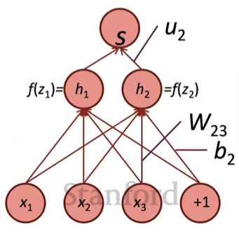

**transposes 인 이유**: dimensions 크기 맞추기 위해

        $$\cfrac{\partial s}{\partial W}\;\;=\quad \delta ^T \quad \; x^T$$

    $$[n \times m] = [n \times 1][1 \times m]$$

                     $$= \begin{bmatrix}
 \delta_1  
\\ \vdots\\
 \delta_n 
 \end{bmatrix}
\begin{bmatrix} x_1, \dots, x_m 
\end{bmatrix}=
\begin{bmatrix}
 \delta_1x_1 
& \cdots 
& \delta_1x_m 
\\ \vdots & \ddots & \vdots \\
\delta_nx_1 & \cdots & 
   \delta_nx_m
 \end{bmatrix} $$

**Jacobian으로 계산 시 $$\frac {\partial s}{\partial b}=h^T\,∘\,f'(z)$$ 는 row vector**

- _shape convertion_ 에서는  b가 column vector기 때문에 gradient 또한 column vector가 나와야 함

# Backpropagation

- taking derivatives and using the *(generalized, multivariate, or matrix)* chain rule

- other trick: re-using derivatives computed for higher layers in computing derivatives for lower layers to minimize computation 

## Forward Propagation

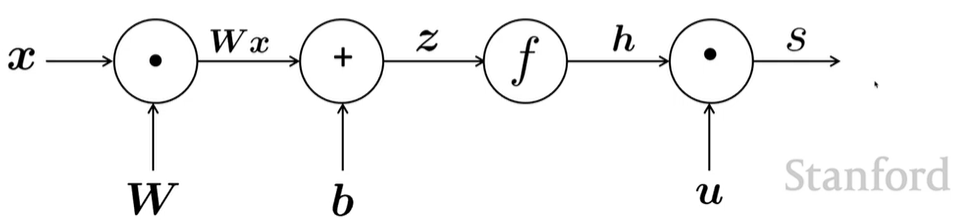

$$x=input
\qquad h=f(z) \qquad z=Wx+b \qquad s=u^Th$$

> source nodes: inputs
> 
> interior nodes: operations
> 
> edges pass along result of the operations

## Backpropagation

loss가 줄어드는 방향으로 학습할 수 있도록 parameters를 수정

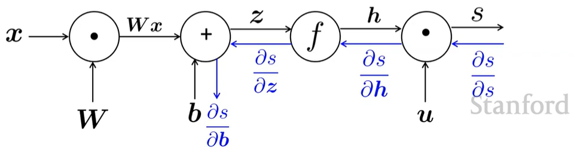

### Single Node

> node가 *upstream gradient* 를 받아 *downstream gradient* 를 전달
> 
> node : *local gradient*

**downsteam gradient = upstream gradient $$\times$$ local gradient**

- single input
  
$$h=f(z)$$
  
  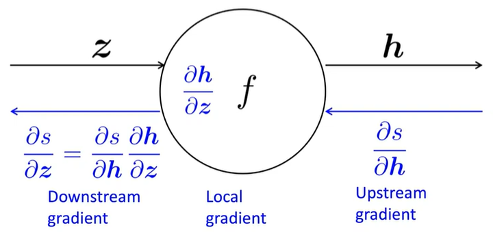

- multiple inputs $$\to$$ multiple local gradients
  
  $$z=Wx$$
  
  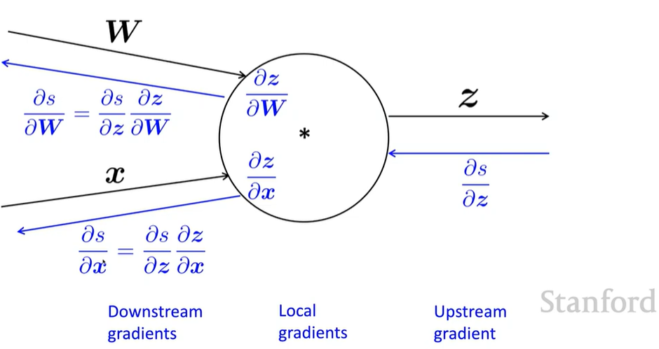

        **example**

        $$f(x,y,z)=(x+y)\,max(y,z)$$

        $$x=1,y=2,z=0$$

        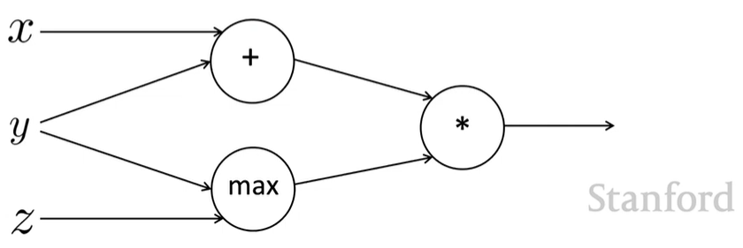

            **forward prop steps**

                $$a=x+y$$

                $$b=max(y,z)$$

                $$f=ab$$

                

            **local gradients**

                $$\cfrac {\delta a}{\delta x}=1\;,\quad \cfrac {\delta a}{\delta y}=1 $$

                $$\cfrac {\delta b}{\delta y}=1(y>z)=1\;,\quad\cfrac {\delta b}{\delta z}=1(z>y)=0$$

                $$\cfrac {\delta f}{\delta a}=b=2\;,\quad \cfrac {\delta f}{\delta b}=a=3$$

                        $$\therefore \cfrac {\delta f}{\delta x}=2\;,\quad \cfrac {\delta f}{\delta y}=3+2=5\;,\quad\cfrac {\delta f}{\delta z}=0$$

### node Intuitions

    **+** : upstream gradient 값을 그대로 downstream 으로 전달 (**distributor**)

          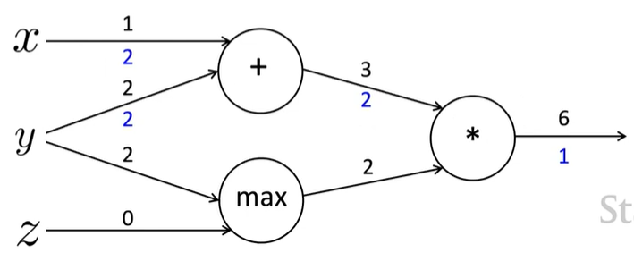

    **max** : 더 큰 값으로만 gradient 전달 (**routor**)

          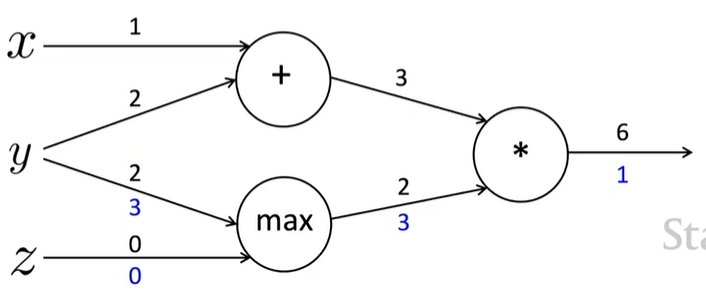

    **x** : upstream gradient 값 서로 바꿈 (**switcher**)

          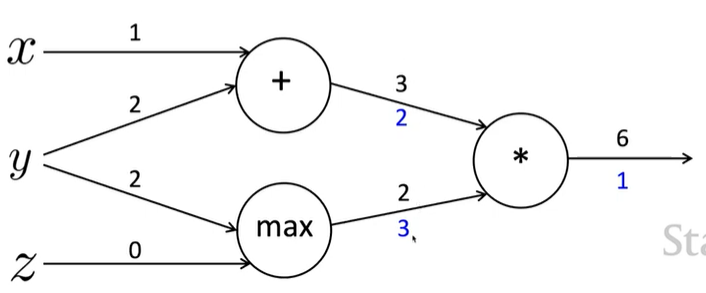

### Efficiency

    **Incorrect**

        $$\cfrac{\partial s}{\partial b}$$ , $$\cfrac{\partial s}{\partial b}$$ 계산을 각각 독립적으로 수행(비효율적)

        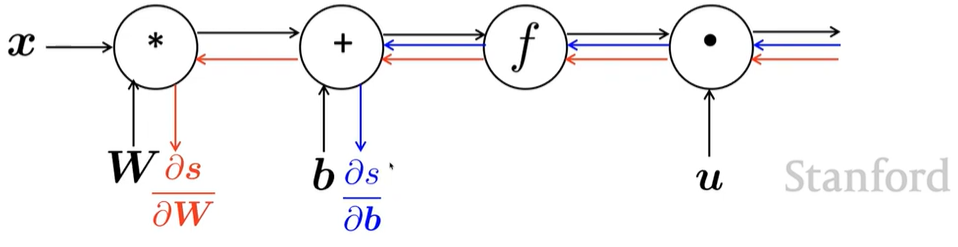    

    **Correct**

        모든 gradient를 한번에 계산

        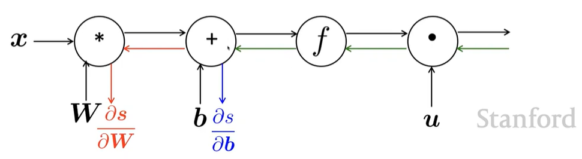

    - gradient 직접 계산할 때 $$\delta$$를 사용하는 것과 유사

## Back-Prop in General Computation Graph

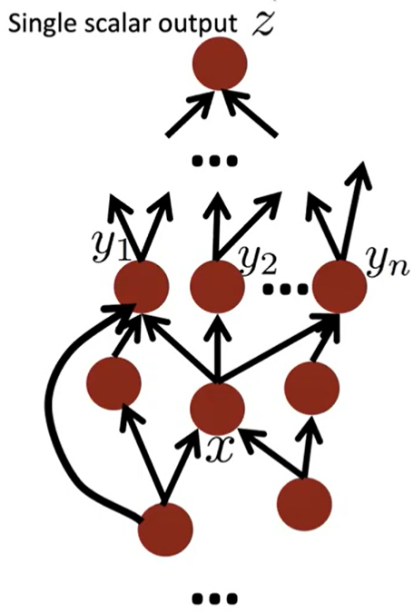

### 1. 순전파

    위상정렬 순서로 _node_ 방문하며 값 계산

### 2. 역전파

    output gradient 1로 초기화한 후, 역순으로 node 방문하면서 gradient 계산

            $$\{y_1,y_2,\dots,y_n\}=$$ successors of $$x$$

            **$$\cfrac {\delta z}{\delta x}=\Sigma^n_{i=1}\cfrac{\delta z}{\delta y_i}\cfrac{\delta y_i}{\delta x}$$**

> 맞게 계산됐다면 순전파, 역전파의 _O(n)_ 는 같다.
> 
> 일반적으로 신경망은 _regular layer-structure_ 이기 때문에 matrices, Jacobians 사용 가능하다.

## Automatic Differentiation

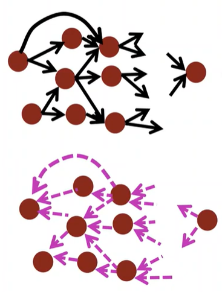

딥러닝 프레임워크들은 gradient 계산을 대신 수행하지만 이 과정을 이해하는 건 우리에게 도움이 되기 때문에 공부하자 !

역전파는 항상 완벽하게 작동되지 않는데, 이와 관련된 개념인 gradient vanishing이나 exploding 을 나중에 배울 예정. 