|         작성자          |   작성일   |
| :-: | :-: |
| 정소연 | 2021.01.18 |

**parsing**이란 각 문장의 문법적인 구성이나 구문을 분석하는 과정이다.

parsing에는 여러가지 방법이 있으나, 본 강의에서는 Constituency parsing과 Dependency parsing을 언급하고 있고 특히 Dependency parsing을 중점적으로 문장 구조를 분석하고 이해하는 방법을 설명하고 있다.

# 1. Syntactic Structure: Constituency and Dependency

## **Phrase structure**란?

(큰 단위의 정보 속에 작은 단위의 정보를) 끼워넣은 구성요소로 단어를 조직.

문장은 많은 단어가 복잡한 관계로 이루어져 있기 때문에 올바른 해석을 위해서는 문장의 구성요소에 대한 분석과 이해가 필수적이다.

## **Constituency Parsing**이란?

문장을 **구성하고 있는 구**를 파악하여 구조를 분석하는 방법. (= phrase structure grammar = context-free grammars (CFGs))

- 각 단어는 문법적 의미를 가지고 있다.
    
    cat는 명사(N), by는 전치사(P), door은 명사(N), cuddly는 형용사(Adj), the는 관형사(Det)
    
- 단어끼리 결합하면 구(phrase)를 구성할 수 있다.
    
    the cuddly cat은 명사구(NP → Det + Adj + N)
    
    by the door은 전치사구(PP → P + N)
    
- 구는 구와 결합하여 더 큰 구를 구성할 수 있다.
    
    the cuddly cat by the door은 명사구(NP → NP + PP)
    

<aside>
💡 nested phrases, what in context free grammar terms you would refer to as non-terminals. So noun phrase and prepositional phrase would be non-terminals in the context free grammar.

</aside>

## **Dependency Parsing**이란?

문장의 **단어 간에 dependency 관계나 수식 방향으로 관계**를 파악하여 구조를 분석하는 방법.

dependency strucutre은 어떤 단어가 다른 단어에 depend(modify, attach to, or are arguments of)하는 지 보여준다.

- 단어간 존재하는 관계는 의존 관계/수식 관계
    - **head**는 수식을 하는 단어
    - **dependent**는 수식을 받는 단어

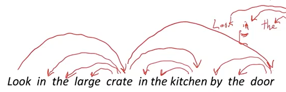
[sequence 형태]

위와 같이 단어 간 관계를 정립하게 되면 문장을 트리 구조로 표현할 수 있게 된다.

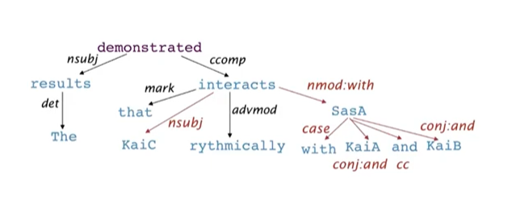

[tree 형태]

Dependency paths help extract semantic interpretation→ simple practical example: extracting protein-protein interaction

트리 구조로 표현하게 된다면 화살표의 방향으로 어떤 단어가 수식을 받는지, 안받는 지 파악할 수 있다.

## **Why do we need sentence structure?**

언어를 정확하게 해석하기 위해 문장구조의 연결  구조에 대한 이해가 필요하다.

만약 그렇지 않다면, 문장에서는 다음과 같은 모호성이 생긴다.

### 1. Prepositional Phrase attachment ambiguity

형용사구, 동사구, 전치사구 등이 어떤 단어를 수식하는지에 따라 의미가 달라지게 된다.

> “Scientists observe whales from space”라는 문장을 살펴보자.
> 

dependent가 from일 때, head가 무엇이냐에 따라 이 문장의 의미는 달라진다.

head가 observe라면 ‘과학자들은 우주에서 고래를 관측했다’이다.

head가 whales라면 ‘과학자들은 우주에서 온 고래를 관측했다’가 된다.

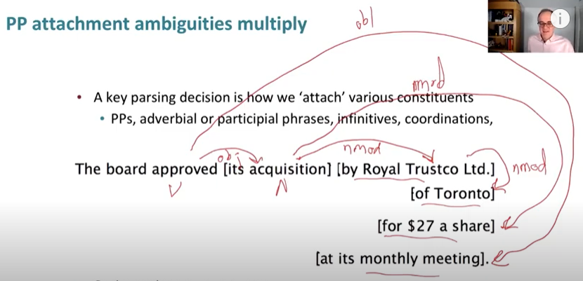

> Catalan numbers
> 

인간의 언어를 parse한 수는  길이에 따라 기하급수적이다. 

exponential number of parse in terms of the number of prepositional phrases

$$
C_n = (2n)!/[(n+1)!n!]
$$

### 2. Coordination scope ambiguity

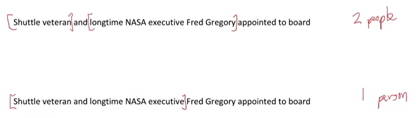

위의 문장은 ‘우주선 베테랑과 오랜 NASA 임원인 Fred Gregory가 이사로 임명되었다.’

아래 문장은 ‘우주선 베테랑이자 오랜 NASA의 임원인 Fred Gregory가 이사로 임명되었다.’

이 예시와 같이 Fred Gregory라는 특정한 단어가 수식하는 대상의 범위가 달라짐에 따라 의미가 달라지게 된다.

### 3. Adjectival/Adverbial Modifier Ambiguity

### 4. Verb Phrase(VP) attachment ambiguity

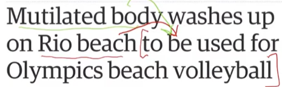

요컨대, Constituency parsing은 문장의 구조를 파악하는 데 중점을 두고 있고 Dependency parsing은 단어간 관계를 파악하는 데 중점을 두고 있다.

# 2. Dependency Grammar and Treebanks                                                                                                                                                                                                       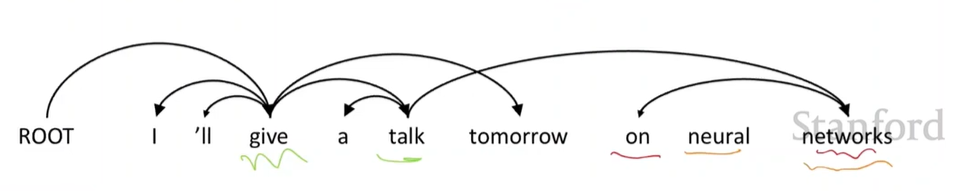           

## Dependency structure

- seqeunce와 tree 두 가지 형태로 표현 가능
- fake ROOT를 추가하여 모든 성분의 최종 head를 ROOT로 설정
- ROOT는 모든 단어가 최소 1개 노드의 dependent가 되도록 함
- Tesnière는 화살표를 *head*에서부터 *dependent*로 가리켰고, 우리는 그 관례에 따름
- A→B, B→A 와 같은 cycle을 허용하지 않음. 중복의 관계가 형성되지 않음
    
    이것이 dependency를 tree구조로 만듦(connected, acyclic, single-root graph)
    
- 마지막 이슈는 arrows가 교차할 수 있는 지(non-projective가 될 수 있음) 아닌지 여부
    
    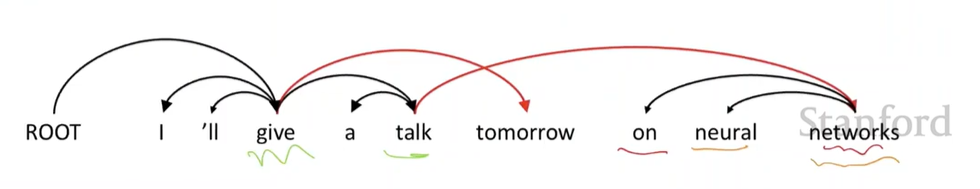  
    
    Dependency syntax postulates that syntactic structure consists of relations between lexical items, normally binary asymmetric relations(”arrows”) called dependencies 
    

## Dependency Conditioning Preferences

종속성 parsing을 위한 정보 source는 무엇인가?

1. Bilexical affinities
    
    두 단어 사이의 실제 의미가 드러나는 관계. dependency[discussion→issues]는 plausible하다
    
2. Dependency distance
    
    주로 dependent 관계는 가까운 단어들 사이에서 형성됨
    
3. Intervening material
    
    구두점(마침표, 세미콜론)을 넘어서 dependent한 관계는 형성되지 않음
    
4. Valency of heads
    
    Valency란 문장 내에서 결합하는 문장 구성 성분의 수를 의미
    
    head의 왼쪽 또는 오른쪽에 몇 개의 dependents를 가질 것인가? 
    

## Dependency Grammar/Parsing History

- 종속성 구조에 대한 아이디어는 오래전부터
- 구성요소/ 문맥이 없는 문법은 new-fangled invention
- 현재 종속성 연구는 종종 Lucien Tesnière에 의한 것.
- 초기 NLP parser에도 사용 됨

## The rise of annotated data

treebank를 쌓는 건 문법을 직접 쓰는 것보다 느려보이고 덜 유용해 보인다.

하지만 treebank는 다음과 같은 이점이 있다.

- labor 높은 재사용성
- 몇몇의 직관이 아니라 광범위하게 적용할 수 있다.
- 빈도와 분포 정보
- NLP 시스템을 평가하는 방법

## Projectivity

- projective parse란?
    
    모든 acrs가 단어 위에 있는 선형 구조로 단어가 배치될 때, 교차하는 종속성 arcs는 존재하지 않는다.
    
- CFG(Context-Free Grammar) tree에 대응하는 종속성은 반드시 projective.
- 대부분의 syntactic 구조는 아래와 같이 projective하다.
    
    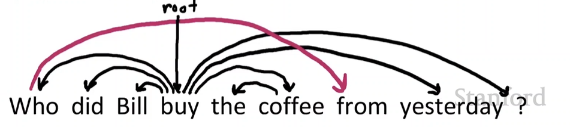  
    
    그러나 종속성 이론은 보통 non-projective구조가 대체된 구성요소를 설명할 수도 있다.
    

# 3. Transition-based dependency parsing

## Methods of Dependency Parsing

1. Dynamic programming
2. Graph alogorithms
3. Constraint Satisfaction
4. Transition-based

본 강의는 Transition-based에 대해 자세히 다루고 있다. 

## **Transition-based parsing이란?**

Dependency parsing의 전통적인 방법으로, 문장의 seqeunce를 차례대로 입력하여 두 단어의 dependency 여부를 차례대로 결정해나가면서 점진적으로 dependency strucutre를 구성하는 방법.

문장의 seqeunce라는 한 방향으로 분석이 이루어지므로 분석 속도는 빠르지만 모든 경우를 고려하지는 못하므로 낮은 정확도를 보이기도 함.

## Basic transition-based dependency parser

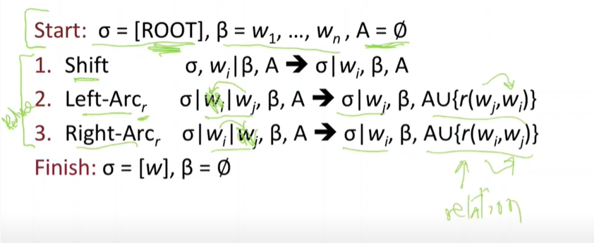  

> stack에서 Decision
> 
- **Shift**: Buffer에서 스택으로 이동
- **Right-Arc**: 우측으로 dependency가 결정
- **Left-Arc**: 좌측으로 dependency가 결정

> “I ate fish” parsing 과정
> 

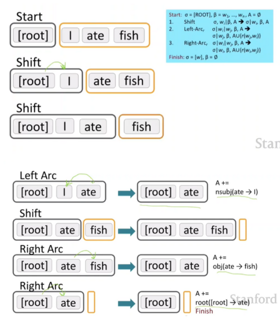  

input으로 문장이 입력되면 **BUFFER, STACK, Set of Arcs**라는 3가지 구조를 거친 후 output으로 parsing 결과가 도출됨.

1. BUFFER에는 ‘I’ ‘ate’ ‘fish’와 같이 주어진 문장이 토큰 형태로 입력되어 있음.
    
    STACK에는 ROOT만 존재.
    
2. STACK에 ROOT만 존재하는 state는 **shift** decision이 내려지면서 ‘I’가 BUFFER에서 STACK으로 이동
3. STACK에 ROOT, ‘I’ 라는 state가 **shift** decision이 내려지면서 ‘ate’이 BUFFER에서 STACK으로 이동
4. STACK에 ROOT, ‘I’, ‘ate’ 라는 state는 ‘ate’이 ‘I’를 수식하는 **Left-Arc** decision이 내려지면서 이 결과(ate, nsubj, I)는 Set of Arcs로 이동함
    
    dependent가 되는 단어 ‘I’는 STACK에서 사라짐
    
5. STACK에 ROOT, ‘ate’ 라는 sate는 shift decision이 내려지면서 ‘fish’가 BUFFER에서 STACK으로 이동
6. STACK에 ROOT, ‘ate’, ‘fish’ 라는 state는 ‘ate’가 ‘fish’를 수식하는 Right-Arc decision이 내려지면서 이 결과(ate, dobj, fish)는 Set of Arcs로 이동함
    
    dependent가 되는 단어 ‘fish’는 STACK에서 사라짐
    
7. STACK에 ROOT, ‘ate’ 라는 state에서 BUFFER에 토큰이 없기 때문에 shift decision 내려지지 않는다. 하지만 모든 토큰은 하나의 dependent를 가진다는 dependency parsing의 특징으로 ROOT가 ‘ate’를 수식하는 Right-Arc decision이 내려지면서 이 결과(ROOT, root, ate)는 Set of Arcs로 이동함

## Greedy transition-based parsing

- Greedy discriminative 종속성 parser의 간단한 형태
- parser는 일련의 bottom-up(세부적인 데서 출발하는) 작업을 수행한다.
    - shift-reduce parser에서 대략 “shift”나 “reduce”와 유사. 그러나 “reduce” 작업은 head가 왼쪽이나 오른쪽으로 종속성을 만들도록 특화됨.
- parser는 다음을 가진다:
    - stack α, top → right
        - ROOT 기호에서 시작
    - buffer β, top → left
        - 입력 문장에서 시작
    - 종속성 arcs A의 집합
        - empty에서 시작
    - 작업의 집합

STACK에서 발생하는 어떠한 state를 기반으로 decision을 결정하기 위해서는 SVM, NN, maxnet과 같은 모델이 적용된다. 이 과정에서 state를 모델이 input으로 받기 위한 state 임베딩 과정이 필요하다.\

state를 임베딩하는 방법으로 MaltParser: A Data-Driven Parser-Generator for Dependency Parsing의 feature representation을 살펴볼 수 있다.

## MaltParser

- 다음 작업을 어떻게 선택하는 지에 대한 설명은 아직 하지 않았다.
    - 답: Stand back, I know machine learning!
- 각각의 작업은 각각의 합법적인 move에 대한 discriminative classifier(e.g., softmax classifier)에 의해 예측된다.
    - 최대 **3개**의 untyped choices 들이 있다; typed 되었을 때는 최대 **|R| x 2 + 1  개**
    - 특징: 스택 단어의 top, POS; 버퍼 단어의 first, POS; 등.
- (가장 간단한 형태에서) search가 없다.
    - 그러나 만약 원한다면 (느리지만 나은)beam search로 유익하게 쓸 수 있다.
    - 각 단계마다 K 개의 양호한 parse 접두사를 유지한다.
- 모델의 정확도는 의존성 parsing에서 최신식 수준까지는 *아주 약간* 아니다.
- 이것은 높은 정확성을 가진-웹 parsing에 적합한-  정말 빠른 선형 시간 parsing을 제공한다

## Conventional Feature Representation

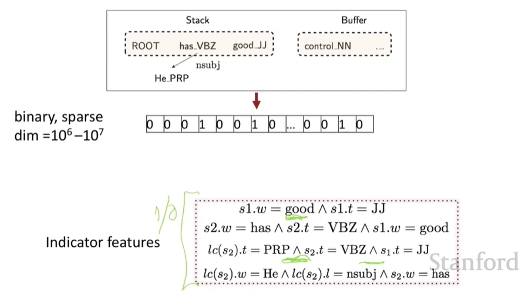 

## Evaluation of Dependency Parsing:(labeled) dependency accuracy

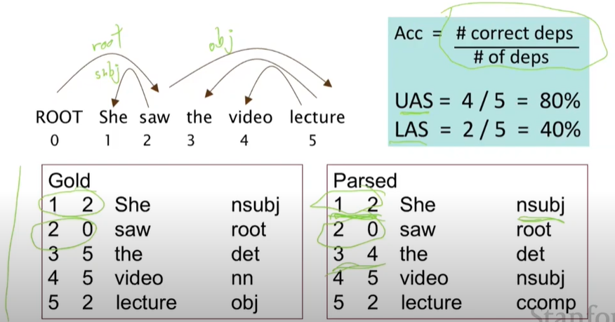 

# 4. Neural Dependency parsing

<aside>
🧐 신경망이 적용된 방법인 Neural Dependency parsing은 어떻게 문장 구조를 분석하는 가?

</aside>