|         작성자          |   작성일   |
| :-: | :-: |
| [김준영](https://github.com/junieberry) | 2022.01.26 |

# **Issue with recurrent models**

## 1. Linear interaction distance

RNN은 왼쪽에서 오른쪽, 혹은 오른쪽에서 왼쪽으로 단방향으로 흐른다.

따라서 RNN은 **Linear Locality**를 가진다.

> *Linear Locality*
> - 근처의 단어에 의해 영향을 크게 받는다.
> - 멀리 있는 단어와 상호작용하기 위해 O(sequence length)만큼의 step이 필요하다.
>   - gradient 문제로 인해 장기 기억(long-term dependency)를 학습하기 어렵다.
>  - 문장이 단방향으로 구성되어 있지 않기 때문에 적절하지 않다.

## 2. Lack of parallelizability

RNN은 단방향으로 흐르기 때문에 병렬 연산이 불가능하다.

> Timestamp $$t$$의 hidden state는 timestamp $$t-1$$의 hidden state 연산 후에 연산할 수 있다.

큰 데이터셋으로 학습하기 어렵다!

 

## RNN의 대안

### 1. Word window

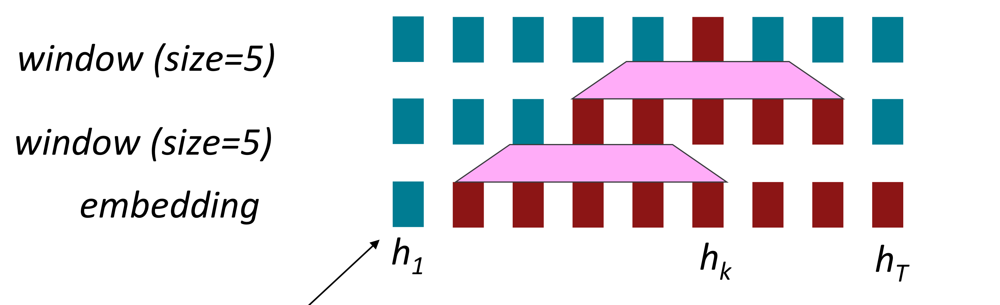

Word window model은 local context를 합쳐서 연산하기 때문에 병렬적으로 연산될 수 있다.

하지만 Word window model에서는 long-distance dependency 문제를 해결할 수 없다.

그림과 같이 여러 층을 쌓아서 context의 범위를 늘려도, $$h_{1}$$를 고려하지 못하는 것처럼 근본적인 해결책이 될 수 없다.

### 2. Attention

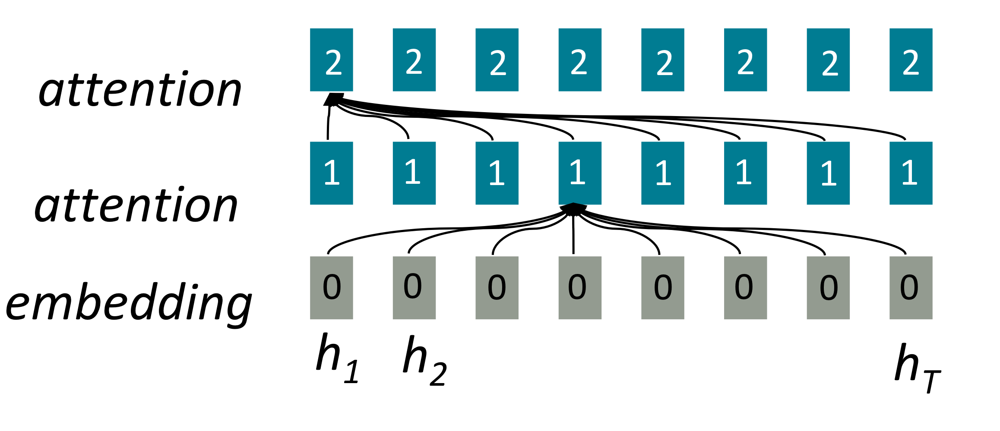

하나의 문장에서의 attention을 고려했을때, attention은 단어의 표현을 query로 value를 계산하기 때문에 병렬적으로 연산될 수 있다.

또한 모든 단어들이 하나의 층에서 interact하기 때문에 Maximum interaction distance가 `O(1)`이다.

> 그림에서 하나의 attention 연산에서 모든 h가 고려되는 것을 볼 수 있다.

따라서 RNN의 문제에 대한 해결책으로 `Attention`이 주목받게 되었다.

 

 

---

# **Self-Attention**

Attention은 **queries, keys, values**를 사용해 연산한다.
1. queries :
   $$q_{1}, q_{2}, ... , q_{T}, q_{i}\in {\mathbb{R}}^{d}$$
2. keys :
   $$k_{1}, k_{2}, ... , k_{T}, k_{i}\in {\mathbb{R}}^{d}$$
3. values : 
   $$v_{1}, v_{2}, ... , v_{T}, v_{i}\in {\mathbb{R}}^{d}$$

이때 **self-attention**에서는 각각 queries, keys, values가 같은 문장에서 나온다.

 

### **self-attention operation**

1. key-query의 유사도 계산
   
   $$e_{ij} = q_{i}^{T}k_{j}$$
2. 1의 유사도의 softmax 연산을 통해 attention weight 계산
   
   $$\alpha_{ij} = \frac{exp(e_{ij})}{\sum_{j^{'}}^{}exp(e_{ij^{'}})}$$
3. 2의 attention weight를 사용해서 ouput 계산
   
   $$output_{i} = \sum_{j}^{}\alpha_{ij}v_{j}$$

### self-attention의 문제

1. self-attention은 input의 순서를 알 수 없다.
2. 비선형성이 존재하지 않은 weighted averagedlek.
3. 순서를 고려하지 않고 연산하기 때문에 sequence를 예측할 때 미래를 보고 있는지 보장할 수 없다.

이러한 문제들을 해결해보자!

## 1. Position representation

Self-attention는 순서 정보를 고려하지 않으므로 sequence index를 나타내는 vector을 사용해서 직접 순서를 인코딩해줘야 한다.

position vector $$p_{i} \in \mathbb{R}^{d}$$ for $$i \in {1,2, ... , T}$$

이때 position vector $$p_{i}$$는 우리의 query, key, value에 그대로 더해지게 된다.

따라서 $$\tilde{v}_{i}, \tilde{k}_{i}, \tilde{q}_{i}$$가 각각 이전 value, key, query일때 위치 정보가 인코딩된 value, key, query는

$$
v_{i} = \tilde{v}_{i} + p_{i}
$$

$$
q_{i} = \tilde{q}_{i} + p_{i}
$$

$$
k_{i} = \tilde{k}_{i} + p_{i}
$$

 

**position vector $$p_{i}$$를 구하는 방법**

1. Sinusoidal position representation
   
    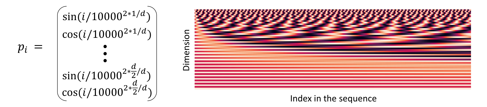
   위와 같이 주기 함수를 사용한다.
2. Learn absolute position representation
   
   Positional representation을 학습 가능한 파라미터로 고려한다.

## 2. Feadforward network

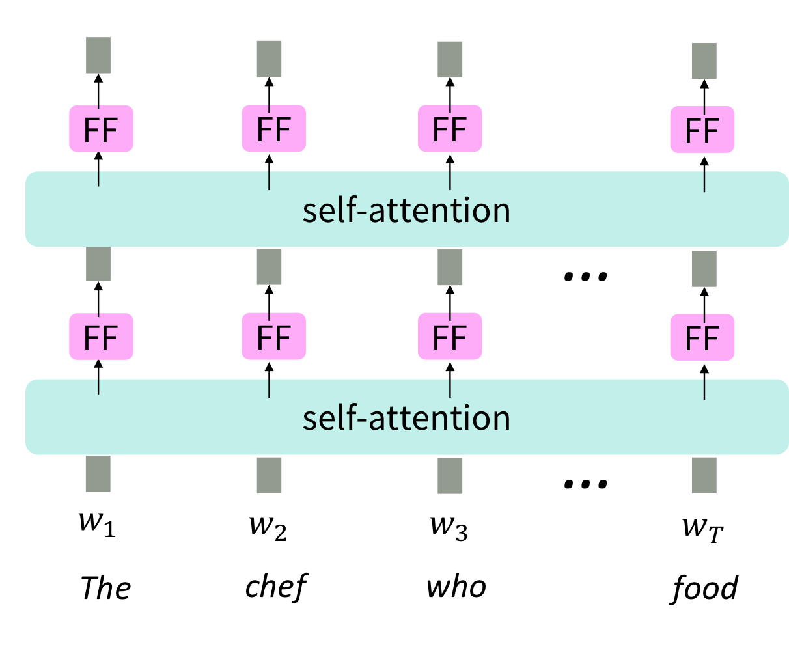

Self-attention 자체는 비선형성이 없는 weighted average와 같다.

Self-attention에 비선형성을 주기 위해서 self-attention 이후에 feedforward layer를 추가한다.

## 3. Mask

text generation 같은 taske에서는 과거의 정보만 알고 있고 미래의 정보는 알지 못한 상태에서 sequence를 예측해야한다.

따라서 decoder에서는 미래의 정보를 보지 못하도록 하는 것이 중요하다.

하지만 매 timestep마다 key와 queries의 집합을 바꾸는 것은 매우 비효율적일것이다.

이 문제를 해결하기 위해 mask를 사용한다.

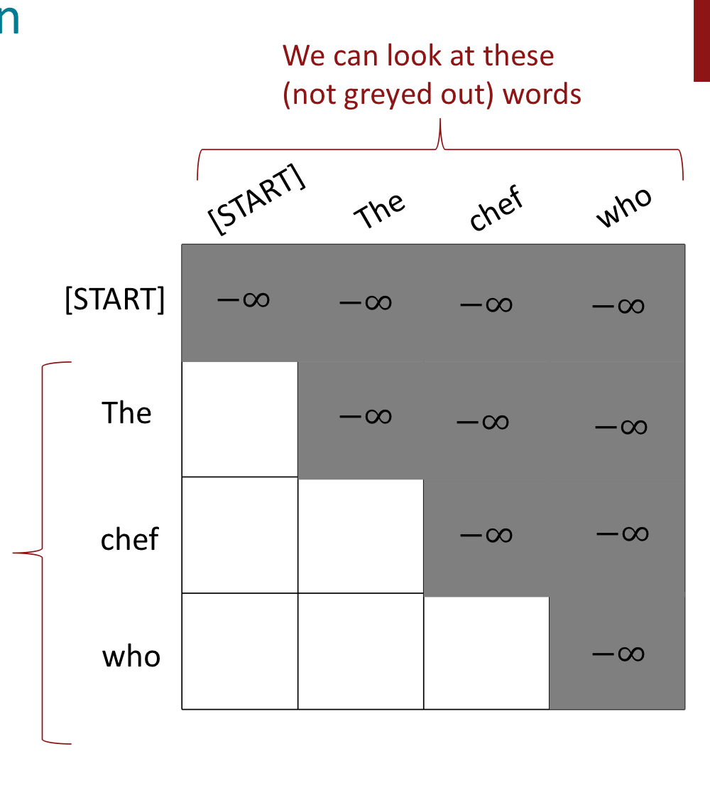

그림처럼 query의 index보다 key의 index가 크면 mask 처리가 되어있는 것을 볼 수 있다.

 

 

---
# **Tansformer**

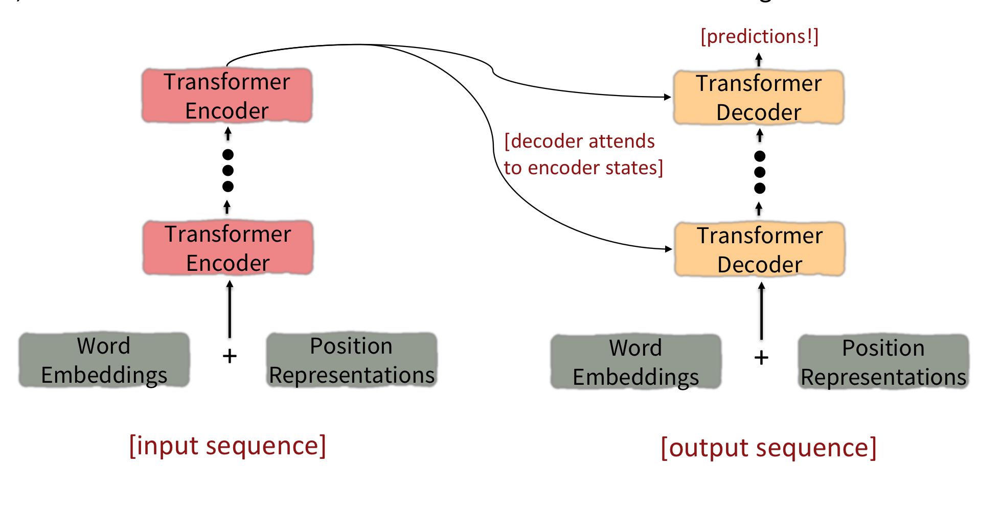

**input sequence**
1. input sequence가 Word Embedding과 Position Representations을 거쳐 Transformer Encoder으로 들어간다.
2. 몇번의 Transformer Encoder block을 거쳐 나온 ouput은 각 Transformer Decoder의 input으로 들어간다.

**output sequence**
1. input sequence가 Word Embedding과 Position Representations을 거쳐 Transformer Decoder으로 들어간다.
2. 각 단계의 Transformer Decoder은 Encoder의 출력값과 이전 단계의 출력값을 사용해 연산을 한다.

이제 transformer의 구조에 대해서 더 알아보자.

## 1. Key-query-value attention

Self-attention의 key, query, value는 같은 문장에서 나온다.

이때 Transformer의 key, query, value는 다음과 같다.

1. $$k_{i} = Kx_{i}$$ where $$K \in \mathbb{R}^{d\text{x}d}$$
1. $$q_{i} = Qx_{i}$$ where $$Q \in \mathbb{R}^{d\text{x}d}$$
1. $$v_{i} = Vx_{i}$$ where $$V \in \mathbb{R}^{d\text{x}d}$$

각각의 K, Q, V는 vector x의 다른 측면을 강조해주는 역할을 한다.

### Key-query-value attention operation

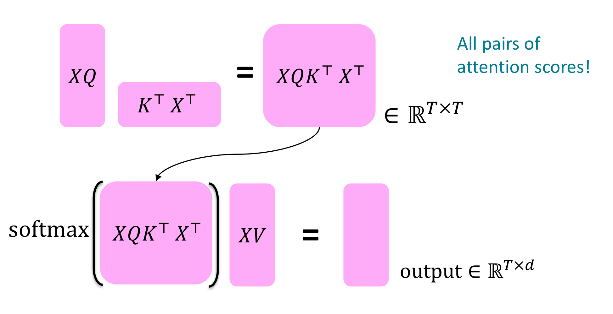

input vecter의 concatenation $$X = [x_{1};...;x_{T}] \in \mathbb{R}^{T\text{x}d}$$일때

$$output = softmax(XQ(XK)^{T})XV$$이다. 

## 2. Multi-headed attention

Multi-headed attention은 여러 개의 attention을 사용해서 다양한 특징에 대한 어텐션을 볼 수 있도록 한다.

Multi-headed attention에서는 query, key, value를 헤드 수만큼 나누어 Linear layer를 통과시키고 self-attention을 구해 합치는 과정을 거친다

attention head의 개수가 $$h$$, $$\mathscr{l}$$가 1부터 $$h$$ 사이일때,
$$Q_{\mathscr{l}}, K_{\mathscr{l}}, V_{\mathscr{l}} \in \Mathbb{R}^{d\teQ_{\mathscr{l}}, K_{\mathscr{l}}, V_{\mathscr{l}} \in \mathbb{R}^{d\text{x}\frac{d}{h}}$$이고, 각각의 어텐션은 독립적으로 연산된다.

따라서 $$output_{\mathscr{l}} = softmax(XQ_{\mathscr{l}}K_{\mathscr{l}^{T}X^{T}}) * XV_{\mathscr{l}}$$, where $$output_{\mathscr{l}} \in \mathbb{R^{\frac{d}{h}}}$$이다.

이렇게 헤드의 개수만큼 나온 output은 마지막에 합쳐지게 된다.

$$output = Y[output_{1};...;output_{h}]$$, where $$Y \in \mathbb{R}^{d\text{x}d}$$

이렇게 Transformer encoder의 input shape과 output shape가 동일하게 유지된다.

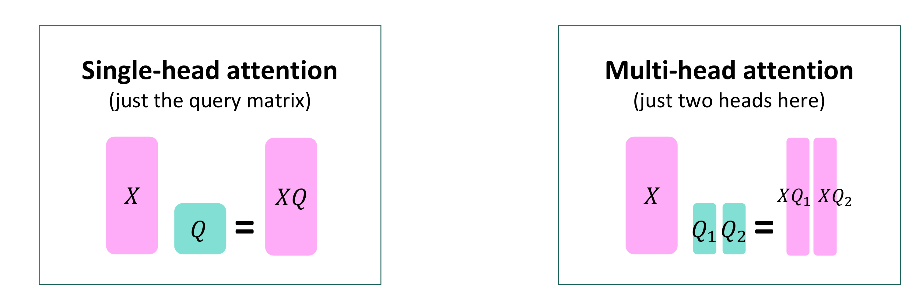

계산량 또한 동일하다.

## 3. Tricks to help with training
1. Residual connection

    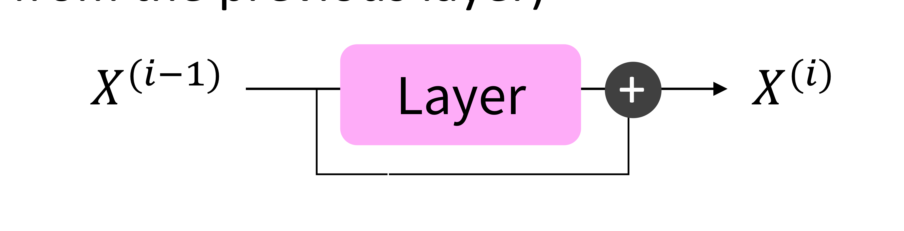

    $$X^{(i)} = Layer(X^{(i-1)})$$ 대신 $$X^{(i)} = X^{(i-1)} + Layer(X^{(i-1)})$$

2. Layer normalizatioin
   
   모델이 더 빠르게 학습할 수 있다.
   각 layer마다 평균과 표준편차를 정규화해서 불필요한 분산을 제거한다.

3. Scaling dot product
    
    dimensioinality $$d$$가 커지면 vector들간의 dot product 또한 커진다.

    softmax 연산에서 큰 값은 작은 기울기를 의미한다.

    따라서 attention score을 $$\sqrt{d/h}$$로 나눠준다.

    $$output_{\mathscr{l}} = softmax(\frac{XQ_{\mathscr{l}}K_{\mathscr{l}}^{T}X^{T}}{\sqrt{d/h}}) * XV_{\mathscr{l}}$$

4. Cross-attention
   
   Decoder에서는 key와 value는 **encoder**에서 가져오고, query는 **decoder**의 값을 사용한다.

   따라서 $$h_{1}, ..., h_{T}$$는 Transformer encoder의 벡터이고, $$z_{1}, ..., z_{T}$$는 Transformer decoder의 벡터일때, 각각 key, value, query는 다음과 같다.

    - $$k_{i} = Kh_{i}$$
    - $$v_{i} = Vh_{i}$$
    - $$q_{i} = Qz_{i}$$

    H와 Z가 각각 encoder vector와 decoder vector의 concatenation이라고 할 때 $$output = softmax(ZQ(HK)^{T})\text{X}HV$$이다.

    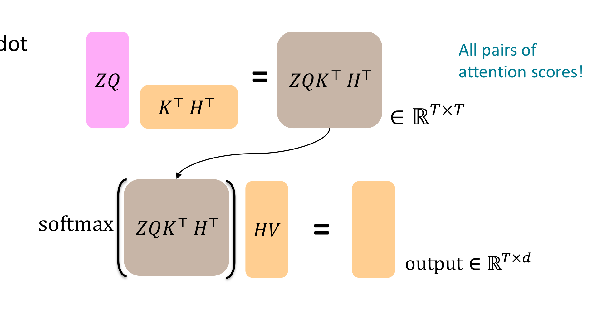

## Summarize

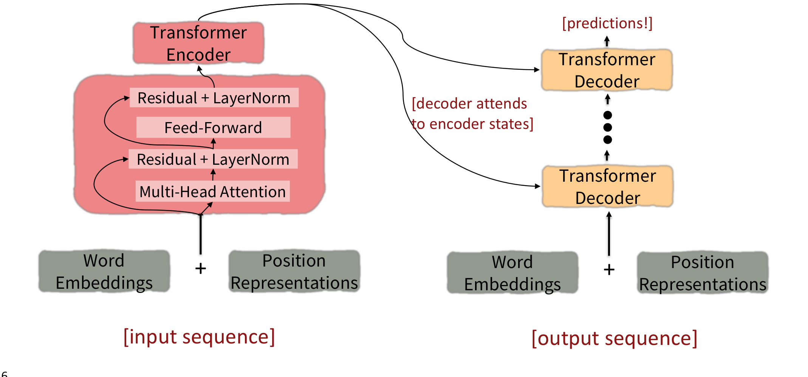

 

# **Drawbacks and variants of Transformers**
## 1. Quadratic comput in self-attention
모든 쌍마다 attention score을 계산하기 때문에 계산량이 quadratically하게 증가한다.
- value와 key의 차원을 줄여 계산량을 줄이는 방법
- 모든 쌍마다 attention을 계산하지 않고 일부만 계산해 계산량을 줄이는 방법

## 2. Position representations
- 최선일까?